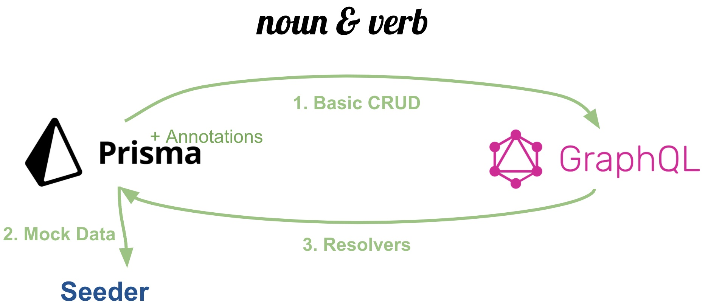

# Noun & Verb
A batteries included GraphQL API generator for [prisma](https://www.prisma.io/) schema(e).

## What does it do?
Implemented as a prisma-generator, it takes a [prisma](https://www.prisma.io/) schema, with 8 `noun & verb` specific annotations and generates a fully functional GraphQL API, along with seeder-scripts.



The `noun & verb` generator does three things:
1. Generates the GraphQL specification for a CRUD Api, that mirrors the CRUD Api exposed by the prisma-client.
2. Generates seeder scripts, to populate the DB with mock data
3. Uses the GraphQL specification (along with any customizations) to generate a working API server

`noun & verb` does this while keeping the spirit of three DX principles:
1. **Minimal specification** The user should have to use the smallest number of key-strokes to specify their intent.
2. **No black magic** All generated code that wires things together should be visible in plain sight and as minimal as possible.
3. **Customization** Every possible customization provided by the underlying libraries, should be made available to the user. Where possible, `noun & verb` will generate the appropriate boiler-plate code, making it a fill-in-the-blanks exercise.


#### Built-in support
`noun & verb` provides support for 
1. built in scalars, via [validator.js](https://www.npmjs.com/package/validator) 
2. built in fake data via [faker](https://fakerjs.dev/)


#### Customization
Additionally, `noun & verb` enables multiple levels of customization:
1. The default CRUD api can be extend with custom "verbs" (aka GraphQL operations)
2. Custom Scalars
3. Custom mock data generators.


## Annotations
Annotations are the key enabler of `noun & verb`. Currently, 8 different annotations are defined of which 6 are fully supported. We'll introduce the annotations first and then show them in use.

### 8 Annotations of `noun & verb`
  1. [`@readOnly`](#readOnly)
  2. [`@createOnly`](#ceateOnly)
  3. [`@writeOnly`](#writeOnly)
  4. [`@scalar`](#scalar)
  5. `@directive` (wip)
  6. `@default` (wip)
  7. [`@seed`](#seed) - applies at the model level
  8. [`@mock`](#mock)

With the exception of the @seed annotation, each of the annotations applies at the model field level.
The prisma client defines three fundamental 


#### `@readOnly`
Extends SQL semantics, designates the field as readOnly. Which means this field does not appear in the Create and Update input type definitions in the GraphQL schema.

This annotation is useful to mark server generated fields - id, timestamps and such.

This annotation takes no arguments

### `@createOnly`
Extends SQL semantics, designates the field as createOnly. This field only shows up in the Create input type 

This annotation is useful to mark fields that are creational in nature. Fields that can only be modified by deleting and recreating the database row.

This annotation takes no arguments

### `@writeOnly`
Extends SQL semantics, designates the field as writeOnly. This field only shows up in the Create and Update input types, but missing from the Read types.

This annotation takes no arguments

### `@scalar`
Designates a "format" for the field, per GraphQL specifications. 
Defines the serialization/de-serialization/validation criteria for the field values. 

This annotation takes one argument, the name of the scalar.

`noun & verb` supports [these 76 scalar types](./supported-scalars.md) out-of-the-box. Using any of these values for the scalar, will generate an appropriate scalar file
properly wired up to use [validator.js](https://www.npmjs.com/package/validator) for  

### `@directive`
This is a work-in-progress. Do not use.

### `@default`
This is a work-in-progress. Do not use.

### `@seed`
Since relational databases cannot be guaranteed to be directed-acyclic-graphs, we use the `@seed` annotation on 
models, to define which models to use as roots of the seeding tree for mock data. A depth first, cycle avoiding walk is performed of from each seed node. Field level `@mock` annotations are used to generate the actual mock data.

The `@seed` implementation means that for many-to-many relations, mock data is generated as one-to-many. One should provide `@seed` annotations to trigger mock data generation in both directions. 

`@seed` typically assumes that root level models have 100 items per table and relationships have between 0/1-20 elements. This is done to create sufficient data to trigger pagination examples in API usage, without overwhelming the mock database. This is however controllable. `@seed` is the only annotations that takes a 
JSON (JSON5 actually) string as an argument to enable this. 

`@seed {count: 100, min: 1, max: 100}`

If count is specified, it overrides. Else a random number between min and max is used to generate a number of mock instances.

### `@mock`
`noun & verb` uses [faker](https://fakerjs.dev/) for built-in mock data generation. Currently, it supports 
[these 155 faker data values](./supported-faker.md).

The supported faker values are specified as 
```
  /// @mock faker.name.firstname
  firstName String
```

It is possible to create custom mocker functions for data types not supported, by using the
mocker prefix, like so:
```
  /// @mock mocker.title
  title    String
```

When using a custom `mocker`, a typescript file is generated in `src/__tests__/fixtures/seeder/mocker/${modelName}/title.ts`.

An additional nuance is that `faker` mocks are considered Independent mocks, in that they do not
rely on the field values of other fields to determine their mock value. 

All `mocker.*` mocks are treated as Dependent mocks, in that they _can_ depend on mock values of
other independent fields. This permits the example below, where the firstName and lastName use 
regular `faker` functions, but a fullName field can use a custom mock that depends upon these
previously computed values. 

The custom mocker functions are a single function that allow creation of dependent values. 
```
  /// @mock faker.name.firstName
  firstName String

  /// @mock faker.name.lastName
  lastName String

  /// @mock mocker.fullName
  fullName String
```

would generate a mocker function as shown below:
```ts
// src/__tests__/fixtures/seeder/mocker/${modelName}/fullName.ts

import * as Faker from 'faker';
import { Independent } from './${model}Generator';

export default async function (faker: Faker.FakerStatic, fields?: Independent, args?: string) {
  // TODO: implement mock data generator for '${model}.${name}'
  // The next line is what would have to be added by you, dear developer.
  return `${fields.firstname} ${fields.lastName}`
}
```


## Production Readiness
`noun & verb` builds upon battle tested open-source modules, and outside the annotations in the [prisma](https://www.prisma.io/) schema, does not introduce any code artifacts. It builds upon  leading battle-tested libraries in the open source and wires them together.

The main components of the generated API server:
1. [Prisma](https://www.prisma.io/) 
2. [GraphQL](https://graphql.org/)
3. [Apollo GraphQL Server](https://www.apollographql.com/)

Please see the dependencies of the generated code for other convenience modules used.


Currently, `noun & verb` generates some tests for the API server. This is a work-in-progress,
but the intent is to generate 100% coverage for generated code with automated tests.


